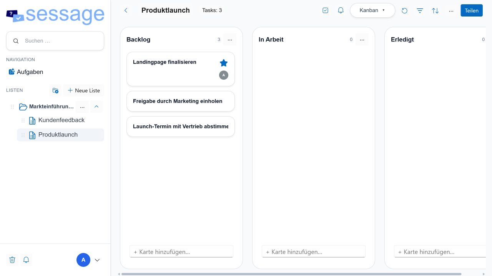
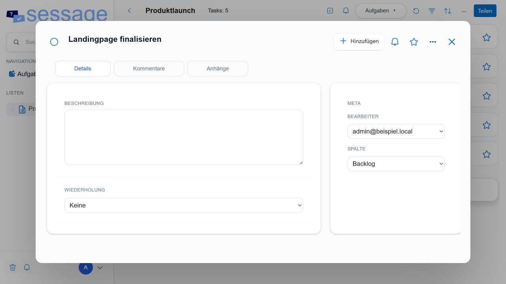
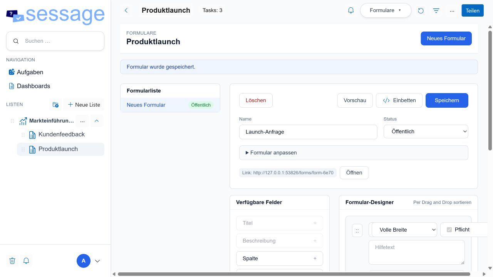
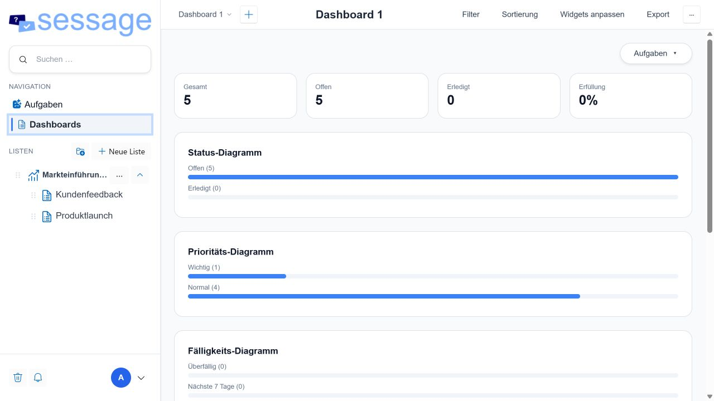

# Sessage Community Server

[](LICENSE.md)
[](https://dotnet.microsoft.com/)
[](https://www.postgresql.org/)
[](https://docs.sessage.com/)

**Sessage Community ist eine offene, eigenständig betreibbare Anwendung für gemeinsames
Aufgabenmanagement.** Teams organisieren Arbeit in Listen, bearbeiten dieselben Aufgaben
in unterschiedlichen Ansichten und behalten Zuständigkeiten, Termine, Kommentare und
Anhänge an einem Ort. Der Community-Kern steht unter der EUPL-1.2 und benötigt keine
Enterprise-Lizenz.

[Dokumentation](https://docs.sessage.com/) ·
[Community installieren](https://docs.sessage.com/community/installation) ·
[Community und Enterprise vergleichen](https://docs.sessage.com/editionen) ·
[Sessage Website](https://sessage.com/en/) ·
[Enterprise kennenlernen](https://sessage.de/de/hosting/)



## Welchen Mehrwert bietet Sessage?

- **Eine verlässliche Arbeitsgrundlage:** Aufgaben, Schritte, Termine, Wichtigkeit,
  Kommentare und Anhänge bleiben am gemeinsamen Vorgang nachvollziehbar.
- **Passende Sicht für jedes Team:** Listen-, Kanban-, Tabellen- und Kalenderansicht
  arbeiten auf denselben Daten; parallele Tabellenkopien werden unnötig.
- **Klare Zusammenarbeit:** Listen lassen sich per E-Mail oder widerrufbarem Link mit den
  Rollen Admin, Mitglied und Beobachter teilen. Aufgaben können Personen zugewiesen werden.
- **Selbstbestimmter Betrieb:** Anwendung und PostgreSQL-Datenbank laufen in der eigenen
  Infrastruktur. Die eigene IT bestimmt Datenstandort, Sicherungen und Updates.
- **Vorhandene Identitäten nutzen:** Neben lokalen Konten unterstützt Community die
  Anmeldung über Active Directory oder generisches LDAP.
- **Offen integrierbar:** Personal Access Tokens, Server-API und die gemeinsame mobile App
  ermöglichen weitere Clients und Integrationen.
- **Ohne Sackgasse starten:** Enterprise verwendet denselben Community-Kern. Bestehende
  Listen und Aufgaben bleiben erhalten, wenn später Organisationsmodule hinzukommen.

| Aufgaben mit Kontext bearbeiten | Zwischen mehreren Ansichten wechseln |
| --- | --- |
|  |  |

## Enthaltene Funktionen

| Bereich | Community-Funktionen |
| --- | --- |
| Organisation | Listen, Navigationsgruppen, Vorlagen, Kopieren und persönliche Sortierung |
| Aufgaben | Schritte, Termine, Wiederholungen, Wichtigkeit, Kartenfarben, Labels, Kommentare und Anhänge |
| Ansichten | Aufgabenliste, Kanban, Tabelle und Kalender |
| Zusammenarbeit | Rollenbasierte Listenfreigaben, Share-Links, Zuweisungen, Beobachter und Benachrichtigungen |
| Daten | Suche, Export, Papierkorb und Wiederherstellung |
| Identität | Lokale Konten sowie Active-Directory-/LDAP-Anmeldung |
| Schnittstellen | Personal Access Tokens, API und gemeinsame Mobile-App |
| Betrieb | Self-Hosting mit PostgreSQL unter Linux oder Windows, mit oder ohne Docker |

Die vollständige Bedienung ist unter [docs.sessage.com](https://docs.sessage.com/)
dokumentiert. Der [Editionsvergleich](https://docs.sessage.com/editionen) grenzt jede
Community- und Enterprise-Funktion einzeln ab.

## Schnell ausprobieren und entwickeln

Voraussetzungen sind das [.NET 10 SDK](https://dotnet.microsoft.com/download/dotnet/10.0)
und ein erreichbarer PostgreSQL-Server.

```bash
git clone https://github.com/Sessage/Community-Server.git
cd Community-Server
dotnet restore Community-Server.slnx
dotnet run --project Community/TodoSuite.Community.csproj
```

Konfigurieren Sie vorher mindestens die PostgreSQL-Verbindung, das initiale
Administratorkonto und einen zufälligen JWT-Schlüssel. Unterstützt werden
`Community/appsettings.json`, eine nicht eingecheckte lokale Konfigurationsdatei,
Umgebungsvariablen und ein externer Secret Store. ASP.NET-Core-Schlüssel werden dabei mit
doppeltem Unterstrich geschrieben, beispielsweise `ConnectionStrings__DefaultConnection`
oder `Jwt__Key`.

> Die eingecheckten Werte sind ausschließlich Entwicklungsbeispiele. Verwenden Sie für
> einen öffentlich erreichbaren Server eigene Datenbank-, Admin-, SMTP-, JWT- und
> LDAP-Geheimnisse und committen Sie diese niemals.

## Produktiv betreiben

Für neue Installationen empfehlen wir den dokumentierten Docker-Compose-Weg. Er umfasst
PostgreSQL, persistente Verzeichnisse, Healthchecks, sichere Konfiguration, Backup und
Updates:

- [Community mit Docker installieren](https://docs.sessage.com/community/installation)
- [Direkter Betrieb als systemd-Dienst auf Linux](https://docs.sessage.com/community/linux-direkt)
- [Vollständige Konfigurationsreferenz](https://docs.sessage.com/docker-konfiguration)

Unabhängig vom Betriebsweg gehören vor die Anwendung ein HTTPS-Reverse-Proxy und ein
regelmäßig geprüfter Sicherungsprozess für PostgreSQL, Uploads, Profilbilder und
ASP.NET-Core-Data-Protection-Schlüssel. Der Endpunkt `/healthz` dient als Liveness-Prüfung.

## Wenn Prozesse größer werden: Sessage Enterprise

Community deckt das tägliche Aufgabenmanagement vollständig ab. **Sessage Enterprise**
ergänzt den offenen Kern für strukturierte Eingänge, listenübergreifende Steuerung und
organisationsweite Berechtigungen:

- benutzerdefinierte Felder und interne oder öffentliche Formulare,
- Portfolios und konfigurierbare Dashboards,
- Automatisierungen, Webhooks und E-Mail-Import,
- Freigaben an einzelne AD-Benutzer und vollständige AD-Gruppen,
- native Push-Nachrichten für Android, iOS und Windows,
- Enterprise-Updates und kommerzieller Support.

| Enterprise Forms | Enterprise Dashboards |
| --- | --- |
|  |  |

Enterprise baut auf denselben Daten und Bedienkonzepten auf. Weitere Informationen,
Editionen und Kontaktmöglichkeiten finden Sie auf
[sessage.com](https://sessage.com/en/) und der
[deutschen Enterprise-Seite](https://sessage.de/de/hosting/).

## Projektstruktur

| Pfad | Aufgabe |
| --- | --- |
| `Community/TodoSuite.Community.csproj` | ASP.NET-Core-/Blazor-Server und Community-Oberfläche |
| `TodoSuite.Community.Shared/TodoSuite.Community.Shared.csproj` | Gemeinsame Domänenmodelle, Verträge und UI-Bausteine |
| `Community-Server.slnx` | Eigenständige Solution für `dotnet`, Visual Studio und andere IDEs |

Beim Start werden ausstehende Entity-Framework-Migrationen angewendet. Änderungen am
Datenmodell müssen deshalb immer mit einer überprüften Migration und einem getesteten
Upgrade einer vorhandenen Datenbank veröffentlicht werden.

## Mitwirken und Sicherheit

Dieses Repository ist ein automatisch erzeugter Veröffentlichungsspiegel. Fehlerberichte
und Vorschläge können hier erfasst werden; dauerhafte Quellcodeänderungen werden im
zentralen Entwicklungsrepository umgesetzt und anschließend reproduzierbar veröffentlicht.
Weitere Hinweise stehen in [CONTRIBUTING.md](CONTRIBUTING.md).

Bitte veröffentlichen Sie ausnutzbare Sicherheitsdetails nicht als öffentliches Issue.
Beachten Sie den Meldeweg in [SECURITY.md](SECURITY.md).

## Lizenz

Der veröffentlichte Community-Kern steht unter der
[European Union Public Licence 1.2](LICENSE.md). Eigenständige Enterprise-, Lizenzierungs-
und sonstige proprietäre Bestandteile sind nicht Teil dieses Repositorys und werden durch
die Community-Lizenz nicht automatisch erfasst.
